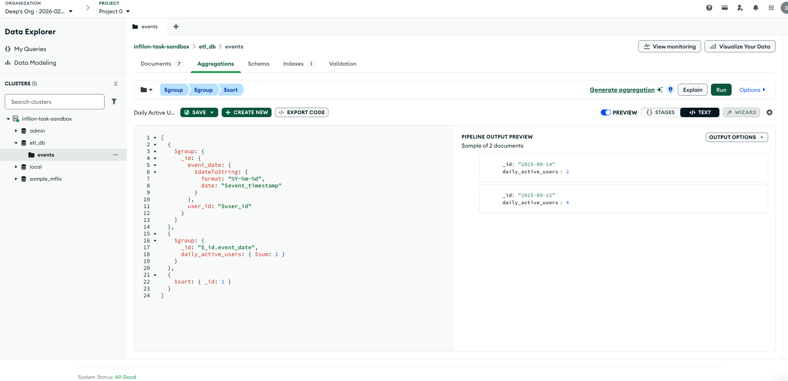
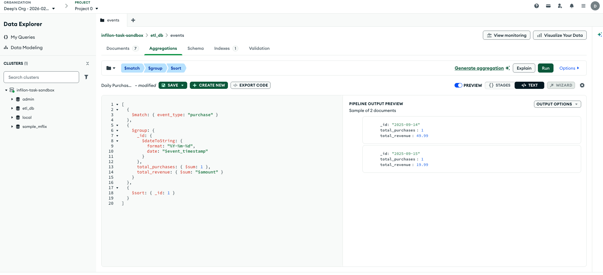

# Analytics Queries (MongoDB)

Analytics queries on the **`events`** collection in MongoDB (`etl_db.events`), populated by the ETL pipeline. Below are the MongoDB aggregation equivalents of the SQL in `analytics_sql_query.sql`, plus expected output descriptions.

## Source collection: `events` (loaded by ETL)

The ETL pipeline loads transformed records into **`etl_db.events`**. Each document has fields such as `user_id`, `event_type`, `event_timestamp`, `device`, and `amount`:


---

## Output results (CSV)

You can view the same query results in CSV format in the **`output/`** folder:

| Query | File |
|-------|------|
| Daily Active Users (DAU) | [output/DAU.csv](output/DAU.csv) |
| Daily Purchases | [output/DAILY_TOTAL_PURCHASE.csv](output/DAILY_TOTAL_PURCHASE.csv) |


## 1. Daily Active Users (DAU)

**Definition:** Count of distinct `user_id` per day.

### SQL (reference)

```sql
SELECT 
    DATE(event_timestamp) AS event_date,
    COUNT(DISTINCT user_id) AS daily_active_users
FROM events
GROUP BY DATE(event_timestamp)
ORDER BY event_date;
```

### MongoDB aggregation

Run in MongoDB Shell, Compass, or any driver against the `events` collection:

```javascript
[
  {
    $group: {
      _id: {
        event_date: {
          $dateToString: {
            format: "%Y-%m-%d",
            date: "$event_timestamp"
          }
        },
        user_id: "$user_id"
      }
    }
  },
  {
    $group: {
      _id: "$_id.event_date",
      daily_active_users: { $sum: 1 }
    }
  },
  {
    $sort: { _id: 1 }
  }
]
```

### Output

One document per day with `_id` (date) and `daily_active_users` (count of distinct users that day).

*Screenshot of DAU query result:*



---

## 2. Daily Purchases

**Definition:** Total number of purchases and total revenue per day (only `event_type: "purchase"`).

### SQL (reference)

```sql
SELECT 
    DATE(event_timestamp) AS event_date,
    COUNT(*) AS total_purchases,
    SUM(amount) AS total_revenue
FROM events
WHERE event_type = 'purchase'
GROUP BY DATE(event_timestamp)
ORDER BY event_date;
```

### MongoDB aggregation

```javascript
[
  {
    $match: { event_type: "purchase" }
  },
  {
    $group: {
      _id: {
        $dateToString: {
          format: "%Y-%m-%d",
          date: "$event_timestamp"
        }
      },
      total_purchases: { $sum: 1 },
      total_revenue: { $sum: "$amount" }
    }
  },
  {
    $sort: { _id: 1 }
  }
]
```

### Output

One document per day with `_id` (date), `total_purchases` (count), and `total_revenue` (sum of `amount`).

*Screenshot of Daily Purchases query result:*

